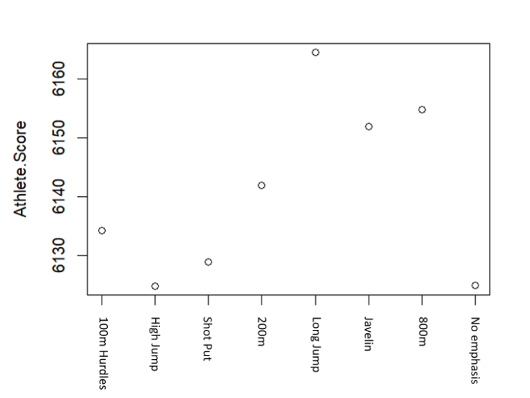
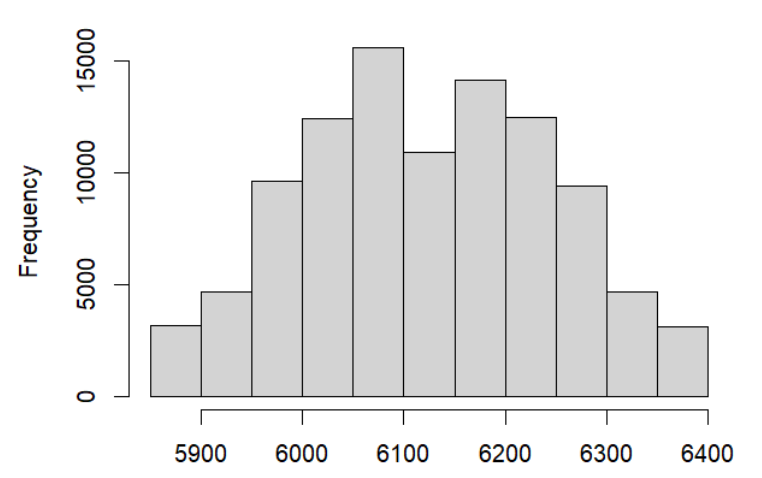
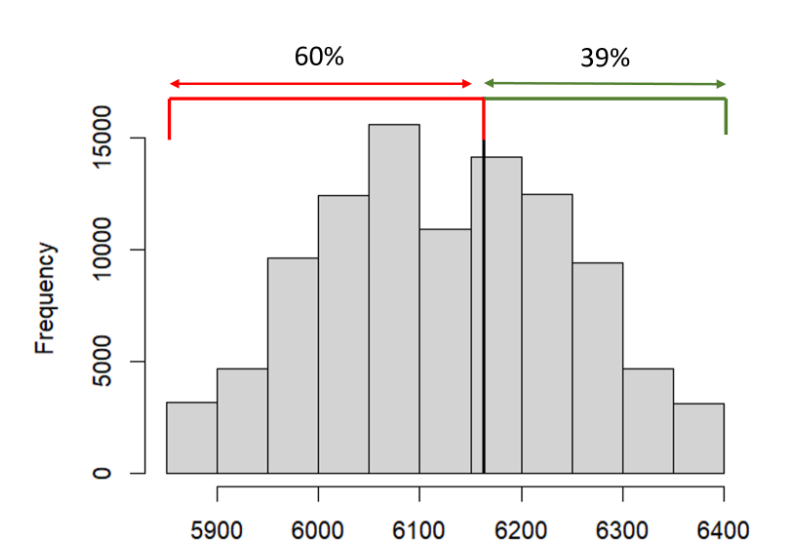
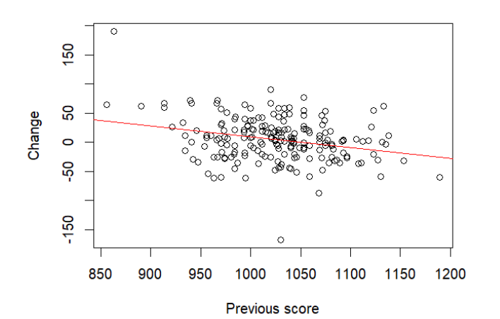
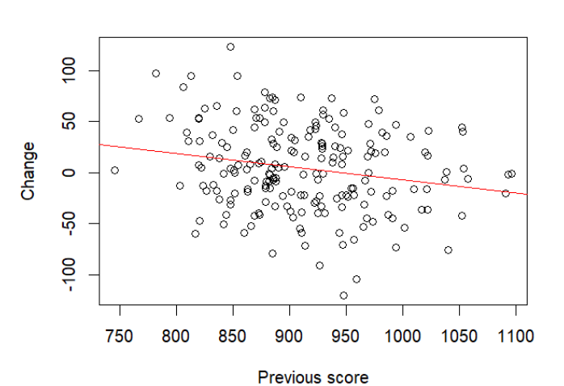

# Heptathlon Predictive Modelling Report

## **Introduction**
Performance is one of the biggest driving factors behind elite sport, it is ultimately what athletes are judged upon (Brewer, 2017). In team sports like football or rugby, where scoring more points than the opposition is the way to win, performance does not always relate to outcomes (Carling et al., 2005). However, in a sport such as the heptathlon a good performance will correlate with a positive outcome (Gassmann et al., 2016), increasing the requirement of a good performance for these elite athletes. These performances, as with all performances, are subject to a level of variability (Atkinson, 2002). Variability within sports performance is something that has been heavily researched (Carling et al., 2016; Gregson et al., 2010; Whiteside et al., 2015) and has come to be a known part of sport. Within simulations and predictive modelling for sports performance this variability is important and should be a key factor (O’Donoghue et al., 2016). Variability itself can be hard to pinpoint with models as its cause can be a multitude of variables both individually and collectively (Diniz Da Silva et al., 2018; Mujika and Padilla, 2000; Tenga et al., 2017) although larger data sets and simulations can help to predict even the most obscure of variabilities (Junqué De Fortuny et al., 2013). 

Within this written report, a predictive model used to simulate and forecast the performance of a heptathlon athlete will be explained, used and scrutinized. The athlete being looked at is Hanna Kasyanova and her performance from the 2008 Beijing Olympics where she placed 13th. The simulation was based on the collective data of 198 other heptathlon athletes, and their scores across two different years. The purpose of this simulation was to investigate if there is a best particular way to focus training in order to simulate the best performance, by finding out which discipline, if there is one, should be emphasized in training. Within Hanna Kasyanova’s case this predictive model could be used to help refine training decisions as she looks to place higher in her next major event. The next event being the 2009 Worlds held in Berlin. This data is also available for this research and can be used in comparison to the simulated outcomes.  The scope of the study is to analyse the resulting data from the simulations across the different disciplines in the heptathlon, this data then can be compared to Hanna’s actual performance in the 2009 Worlds event.  

## **Methods**
This section will look into how the model was created and its inner workings. Showcasing how it aims to predict performance and what helps make the model effective. Predictive modelling and simulation have become common practice within sport (Baboota and Kur, 2019; Baca, 2018; Muñoz-Pérez et al., 2024). Its use varies from injury prevention to attendance prediction (Barbier et al., 2023; Kolodziej et al., 2023; Ruddy et al., 2018). There have also been plenty of use for predicting performance (Baboota and Kur, 2019; Giménez et al., 2020), providing a solid basis for which this study stands upon. The model begins by plotting the year-to-year change in scores for each discipline. This was something that has been previously used within heptathlon predictive modelling in order to help find a linear regression (Dinnie and O’Donoghue, 2020). This year-to-year change was calculated using the difference from the year 1 score and year 2 score, this was done for each athlete and for all the 7 disciplines. By plotting the year-to-year change against the year 1 score a line of best fit can be drawn, allowing for linear regression. Once this line has been created, residuals can be calculated by comparing the year 2 scores with the line of best fit. Next the programme will create 5 quintiles and split the year-to-year change values into these quintiles. These values were ordered by their matching residuals. The values that are used to determine the breakoff between one quintile and the next were calculated based on the number of athletes. With 198 athletes and 5 quintiles the break off values were determined as so: values 1-39 were in quintile 1, 40-79 were quintile 2, 80-118 were quintile 3, 119-158 were quintile 4, and 158-198 were quintile 5. Quintiles were made for each of the seven disciplines. These quintiles are used for the purposes of variability and emphasis on the chosen discipline, which is something that happens later on in the programme. Variability was added into this model as it is something that should be considered during every predictive modelling exercise (O’Donoghue et al., 2016). As sport in itself is unpredictable (Hristovski, 2017), so should be the outcome of any predictive model. Having variability within these predictions allows for a much better assessment of the possible outcomes (Atkinson, 2002). Lastly Hanna Kasyanova’s year 1 scores for each of the seven disciplines are inserted into the code to be used as the scores to run the simulations off. Hanna’s scores were: 1047 for the 100m hurdles, 978 for high jump, 739 for shot put, 947 for 200m, 975 for long jump, 589 for javelin and 890 for 800m.

With all the set up complete the simulations could now be undertaken. For this study the predictive model was simulated 100,000 times, although this number could be increased to improve the accuracy of the model. The simulation is split up into two main sections, the first section calculates the predicted change from the year 1 scores, and the second section puts emphasis on one of the seven disciplines enhancing its score. The predicted change is calculated for one of the disciplines, then moves onto the next until all the disciplines are calculated. This is done by using the linear regression and line of best fit to predict the change in score for the discipline, the score will then be matched up with one of the five quintiles depending on the value and where it fits between the break off points. This is how variability is added to the score. Within the selected quintile a random number will be chosen. If quintile one is chosen then the random number will be between 1 and 39, if quintile two the random number will be between 40 and 79 for example. The random number selected will correspond to a value of one of the residuals calculated previously, this residual, whether negative or positive will then be added to the predicted score to finish. With this the quintiles incorporate a level of controlled variability within the model. This takes place for six of the seven disciplines. The final discipline is the one that will be emphasised. This discipline is also chosen at random, and simulations can occur where no discipline is chosen to be emphasised, if this happens then all seven disciplines would have their predicted change calculated as described above. With this there are eight possible emphasis choices, one for each of the disciplines and the final with no discipline emphasised. With the simulation occurring 100,000 times it averages out that each possible emphasis choice would happen 12,500, offering plenty of data for the model to use. The way that the emphasised discipline’s score is calculated is similar to the non emphasised. The linear regression is used to calculate the predicted change, and then matched into a quintile, however it differs when it picks two random numbers within the chosen quintile. Because the discipline is emphasised, and you would expect this emphasised training to improve the resulting score, out of the two random numbers picked the higher number is used to be added onto the predicted score. The same random number can be chosen both times during this exchange. Knowing this, the odds of pairing up with a better residual due to the max of two random numbers being selected can be calculated. Due to Hanna Kasyanova’s data being removed from the pool, one quintile has one less value within it. Quintiles 1, 2, 4 and 5 all have 39 values, while quintile 3 has 38. The calculation would be = ((n * (n – 1)) / 2) / n2 where n represents the number of values in the quintiles pool. Within quintiles where there are 39 values there is a 48.717% chance of improving you score from emphesising the discipline, whereas in the 3rd quintile with 38 values there was a 48.684% chance of improving. With this being said it is important to note that although there is only a 48% chance of improvement due to emphasis, the other 52% does not signify a reduction in score due to emphasis, but simply means that there was no improvement in score due to emphasis. This again helps to maintain a level of variability throughout the model.  To finish off the simulation, the predicted points of all the disciplines are summed up and the discipline that was emphasised is noted, once this has been simulated 100,000 times an average total score for predicted points is created based on the eight different emphasis scenarios. These scores are then plotted onto a graph to show which emphasis had the highest sum of predicted points.

## **Results**
Once the simulation has been run 100,000 times the results can be gathered. Below is a figure that shows the average total points per discipline emphasised. As shown the gap between the highest and lowest scores is only about 40 points, but those 40 points could be the difference between first and second place. Based on the results of the model, the discipline that should be emphasised in training is long jump.

Figure 1 – Total athlete score per discipline emphasised

Figure 2 depicts the variability of scores produced by the model and the frequency of the scores. The five central columns all boast a frequency of 10,000 or more making them take up well over 50% of the total simulations. Comparing with figure 1, where the average score is shown to be between 6130 – 6160, the spread of figure 2 shows possible scores from 5900 up to 6400. The score 6145 sits almost directly central, within this distribution chart, like that of normal distribution. The graph also resembles a bell curve seen in normal distribution, however interesting the very central column, although containing the average scores, dips in frequency compared to those around it. Overall, this figure shows that the steps taken to involve variability within this predictive model worked.

 Figure 2 – Variability and frequency of total sim points.

Hanna Kasyanova, before her Olympic debut in Beijing 2008 had only competed in 4 major events, being made up of 3 heptathlon performances across the European under 23’s championships, the Universiade and the World championships, and 1 pentathlon performance during the European indoor championships (Wikipedia, 2024). With her first event in 2005, she was a new talent, being chosen to represent her country at the Olympics only 3 years after her first recorded professional competition. Her heptathlon performance during the 2008 Beijing Olympics yielded her best score at the time, with a score of 6165 placing 14th. With the World championship coming up again in 2009, Kasyanova should be aiming to place within the top 10 and setting a personal best, this event would be a large step in her heptathlon career. Her training should be intense and backed by data to best increase her chances of a good performance.  Based off the distribution shown in figure 2 the probability of her beating her personal best of 6165 is 39%. This was calculated by finding the percentage of all simulations where the total points were predicted above 6165. This percentage distribution is shown in figure 3.

Figure 3 – Percentage of predicted point distribution (rounded to the nearest integer)

 For the 2009 World championships to place top 3 and get a podium spot, Kasyanova would have had to earn 6471 points (Wikipedia, 2022), and based off the predicted points this she would have had less than a 1% chance of succeeding in this goal. To place in the top 10 a score of 6127 was needed, which Kasyanova had already been able to achieve at the Olympics, therefore setting a goal for top 5 would make more sense. The points needed for a top 5 finish was 6417, again giving Kasyanova a less than 1% chance according to the predictive model. Dinnie and O’Donoghue (2020) conducted similar case studies into heptathlon athletes looking at which discipline each athlete should focus on in training to yield the best results. In these case studies multiple disciplines are considered. For Kasyanova the two disciplines that should be considered are long jump, as identified by the predictive model, and javelin. Javelin was chosen as Kasyanova’s 3rd choice for emphasis training according to the model, it was also her worst discipline, therefore allowing the most potential for growth. As the linear regression analysis showed in this model, the better the year 1 score in a discipline is, the harder it is to improve upon. Figure 4 and 5 show this using examples of the 100m hurdles and long jump.

Figure 4 – Year-to-year change within the 100m hurdles discipline

Figure 5 – Year-to-year change within the long jump discipline

To reach her current PB (World Athletics, 2024) for long jump and increase her score in the discipline to 1160, Kasyanova would have to increase her jump distance from 6.39m to 6.74m. For the javelin throw, Kasyanova would need to increase her throwing distance from 35.88m to 46.61m to reach her current PB and score 831 points (World Athletics, 2024). Such a large increase does not seem as feasible as the long jump improvement, therefore, adhering to the model, Kasyanova should look to emphasise her long jump training, placing a small emphasis on javelin improvements, to best improve her score.

## **Discussion**

This model’s purpose was to simulate and predict Hanna Kasyanova’s score based off other similarly scoring heptathlon athletes, with the intent of aiding training by knowing what discipline to emphasise. By this definition, the model was a success as it clearly predicted her scores whilst highlighting which discipline should be emphasised for the best possible performance. Also, the model tried to use a level of variability to replicate the variability of sport (Vicente et al., 2024). The variability of the final predictive scores suggests that this was also completed effectively, although there was still room for improvement. Similarly, the emphasising part of the model worked as intended in sometimes improving the score of the emphasised discipline. This again showcased good variability within the model to show that emphasising an event does not guarantee better results, however there were also some weaknesses with the way this model produced this. This model was successful in fulfilling its intention, allowing it to be of good use within the professional sporting industry. The most obvious, and main intent, use for this model is for athlete use, operating this model to simulate performances and locate areas which the athlete can improve their performance on. Athlete use of predictive model is common within sport (Ahsan et al., 2023; Blanchfield et al., 2019; Heazlewood, 2006). This mainly occurs within individual sports such as athletics (Efiong et al., 2019; Heazlewood, 2006) and would therefore make it perfect for use with heptathlon athletes.  Although predictive models can be used with athletes in team sports (Beggs, 2024; Brooks et al., 2016; Fialho et al., 2019; Lehmus Persson et al., 2020) this model focuses solely on individual performance and would struggle taking into factors that could affect performance such as other players. Within its athlete use, the model should be employed as a factor in decision making rather than something that gives the final say in decisions. This is shown by the results of the model, as it predicted Kasyanova a >0.1% chance of scoring over 6400 in her 2009 Worlds Championship. Whereas in reality Kasyanova scored 6414 points, where her most improved discipline was the long jump but was the javelin throw. Although this could have been just as the model predicted, a very lucky performance for Kasyanova, it still showcases a reason why it should be used in complements with other traditional approaches. Heazlewood (2006) also found that their athletics model struggled predicting variability in performance. This is due to the unpredictable nature of sports (De Souza Barba, 2015). Even though team sports like soccer or rugby are the most unpredictable due to outside influences that come with team sports (Rubin, 2014; Vicente et al., 2024), individual sports can be just as unpredictable (Hung et al., 2003; McCann, 2008). This model’s use for coaches and governing bodies is like its use for athletes, with the change of being used for multiple athletes. The model can withstand larger data sets which governing bodies may use to help track average athlete progression (Haugen et al., 2008; Horvat, 2022), this can also be used as a means of doping control, by tracking and predicting performances to spot any sudden spikes or drops (Hopker et al., 2018, 2024; Iljukov and Schumacher, 2017). Coaches should use the model as a tool to help improve their team of athletes in their performances, or use it to predict opposing athletes' scores, to alter your own athletes' training accordingly. Finally, sports betting companies should use the model to help predict athlete performance (Brefeld et al., 2022; Ruzicka and Chovanec, 2019).

## **Conclusion**
In conclusion, predictive models hold a clear place within the sporting industry, whether it be for performance or governing uses (Horat, 2022). Although the scores predicted for Kasyanova’s performance did not align with her actual performance, the variability and emphasis sections of the model performed as expected. Further tests using the model would be needed to test the accuracy of the predictions made. Some final improvements that could be made to the model in future uses include that of variability, emphasising and the data set used. Whilst the quintiles used within the model did offer a sort of variability in score, this was limited to the variability of the athletes within the data set, with 198 athletes and an average of 39 in each quintile, there was a limited amount of variability possible, which could not predict some outcomes such as Kasyanova’s score. Another issue with the data set was the lack of prior Kasyanova performances involved. Athletes may improve or regress at different rates, therefore using other athletes’ scores to predict Kasyanova’s performance might not offer the best predictions. Involving her previous year-to-year changes and adding emphasis on these scores to predict her performance may have improved the model's accuracy. Finally, as calculated the emphasis on a discipline only offered a 48% chance of improvement, knowing that this cannot be made a 100% chance to maintain variability, this percentage could be increased to 60-70% to offer a more realistic improvement level on emphasised disciplines.

## **References:**
Ahsan, M., Ahmed, M. and Azeem, K. (2023) ‘Role of predictive modeling and personalized modeling in the enhancement of athletic performance’, Saudi Journal of Sports Medicine, 23(1), p. 7. 

Atkinson, G. (2002) ‘Sport performance: variable or construct?’, Journal of Sports Sciences, 20(4), pp. 291–292. 

Baboota, R. and Kaur, H. (2019) ‘Predictive analysis and modelling football results using machine learning approach for English Premier League’, International Journal of Forecasting, 35(2), pp. 741–755. 

Baca, A. (2018) Modelling and Simulation in Sport and Exercise. 1st edn. Routledge. 

Barbier, A., Evrard, B. and Dermit-Richard, N. (2023) ‘Predictive Modelling of Sports Facility Use: A Model of Aquatic Centre Attendance’, Sustainability, 15(5), p. 4142. 

Beggs, C. (2024) Soccer analytics: an introduction using R. Boca Raton, FL: CRC Press.

Blanchfield, J.E. et al. (2019) ‘Developing Predictive Athletic Performance Models for Informative Training Regimens’, in 2019 Systems and Information Engineering Design Symposium (SIEDS). 2019 Systems and Information Engineering Design Symposium (SIEDS), Charlottesville, VA, USA: IEEE, pp. 1–6. 

Brefeld, U. et al. (eds) (2022) Machine Learning and Data Mining for Sports Analytics: 8th International Workshop, MLSA 2021, Virtual Event, September 13, 2021, Revised Selected Papers. Cham: Springer International Publishing (Communications in Computer and Information Science).

Brewer, C. (2017) Athletic Movement Skills: Training for Sports Performance. 1st edn. Human Kinetics. 

Brooks, J., Kerr, M. and Guttag, J. (2016) ‘Developing a Data-Driven Player Ranking in Soccer Using Predictive Model Weights’, in Proceedings of the 22nd ACM SIGKDD International Conference on Knowledge Discovery and Data Mining. KDD ’16: The 22nd ACM SIGKDD International Conference on Knowledge Discovery and Data Mining, San Francisco California USA: ACM, pp. 49–55. 

Carling, C. et al. (2016) ‘Match-to-match variability in high-speed running activity in a professional soccer team’, Journal of Sports Sciences, 34(24), pp. 2215–2223.

Carling, C., Williams, A.M. and Reilly, T. (2005) Handbook of soccer match analysis: a systematic approach to improving performance. London ; New York: Routledge.

De Souza Barba, L. (2015) ‘Controlling and Predicting Unpredictable Behavior’, The Behavior Analyst, 38(1), pp. 93–107. 

Diniz Da Silva, C., Braga, C.P. and Pollard, R. (2018) ‘The effect on home advantage when a team changes from grass to artificial turf – a worldwide study in professional football’, International Journal of Performance Analysis in Sport, 18(2), pp. 310–317.

Dinnie, A. and O’Donoghue, P. (2020) ‘Strategic target setting in the heptathlon’, Journal of Sports Analytics, 6(2), pp. 129–145. 

Efiong, J.E., Olajubu, E.A. and Aranuwa, F.O. (2019) ‘Formulation of Sprint Time Predictive Model for Olympic Athletic Games’, International Journal of Information Technology and Computer Science, 11(4), pp. 33–43. 

Fialho, G., Manhães, A. and Teixeira, J.P. (2019) ‘Predicting Sports Results with Artificial Intelligence – A Proposal Framework for Soccer Games’, Procedia Computer Science, 164, pp. 131–136. 

Gassmann, F., Fröhlich, M. and Emrich, E. (2016) ‘Structural Analysis of Women’s Heptathlon’, Sports, 4(1), p. 12. 

Giménez, J.V. et al. (2020) ‘Predictive modelling of the physical demands during training and competition in professional soccer players’, Journal of Science and Medicine in Sport, 23(6), pp. 603–608. 

Gregson, W. et al. (2010) ‘Match-to-Match Variability of High-Speed Activities in Premier League Soccer’, International Journal of Sports Medicine, 31(04), pp. 237–242. 

Haugen, T.A. et al. (2018) ‘Peak Age and Performance Progression in World-Class Track-and-Field Athletes’, International Journal of Sports Physiology and Performance, 13(9), pp. 1122–1129.

Heazlewood, T. (2006) ‘Prediction versus reality: the use of mathematical models to predict elite performance in swimming and athletics at the olympic games’, Journal of Sports Science & Medicine, 5(4), pp. 480–487.

Hopker, J. et al. (2018) ‘Athlete Performance Monitoring in Anti-Doping’, Frontiers in Physiology, 9, p. 232. 

Hopker, J.G. et al. (2024) ‘Competitive performance as a discriminator of doping status in elite athletes’, Drug Testing and Analysis, 16(5), pp. 473–481. 

Horvat, T. (2022) ‘The use of machine learning in sport outcome prediction: A review’, WIREs Data Mining and Knowledge Discovery, 12(2), p. e1445. 

Hristovski, R. (2017) ‘Complex Systems in Sport, International Congress: Linking Theory and Practice’, in Complex Systems in Sport, International Congress: Linking Theory and Practice. Complex Systems in Sport, International Congress: Linking Theory and Practice, Frontiers Media SA. 

Hung, T.-M. et al. (2003) ‘The Effects of Uncertainty on Attention in Table-Tennis Players and Nonathletes’, (3). 
Iljukov, S. and 10.15546/aeei-2019-0018, Y.O. (2017) ‘Performance Profiling—Perspectives for Anti-doping and beyond’, Frontiers in Physiology, 8, p. 1102. 

Junqué De Fortuny, E., Martens, D. and Provost, F. (2013) ‘Predictive Modeling With Big Data: Is Bigger Really Better ?’, Big Data, 1(4), pp. 215–226. 

Kolodziej, M. et al. (2023) ‘Predictive modeling of lower extremity injury risk in male elite youth soccer players using least absolute shrinkage and selection operator regression’, Scandinavian Journal of Medicine & Science in Sports, 33(6), pp. 1021–1033. 

Lehmus Persson, T. et al. (2020) ‘Prediction of Tiers in the Ranking of Ice Hockey Players’, in U. Brefeld et al. (eds) Machine Learning and Data Mining for Sports Analytics. Cham: Springer International Publishing (Communications in Computer and Information Science), pp. 89–100. 

McCann, S. (2008) ‘At the Olympics, everything is a performance issue’, International Journal of Sport and Exercise Psychology, 6(3), pp. 267–276. 

Mujika, I. and Padilla, S. (2000) ‘Detraining: Loss of Training-Induced Physiological and Performance Adaptations. Part II: Long Term Insufficient Training Stimulus’, Sports Medicine, 30(3), pp. 145–154. 

Muñoz-Pérez, I. et al. (2024) ‘Predictive performance models in marathon based on half-marathon, age group and pacing behavior’, Sport Sciences for Health [Preprint].

Nauta, M.J. (2007) ‘Uncertainty and variability in predictive models of microorganisms in food’, in Modelling Microorganisms in Food. Elsevier, pp. 44–66.

O’Donoghue, P. et al. (2016) ‘Predictive models of the 2015 Rugby World Cup: accuracy and application’, International Journal of Computer Science in Sport, 15(1), pp. 37–58. 

Rubin, J.D. (2014) ‘Making Art from Uncertainty: Magic and Its Politics in South African Rugby’, Cultural Anthropology, 29(4), pp. 699–719. 

Ruddy, J.D. et al. (2018) ‘Predictive Modeling of Hamstring Strain Injuries in Elite Australian Footballers’, Medicine & Science in Sports & Exercise, 50(5), pp. 906–914. 

Ruzicka, M. and Chovanec, M. (2019) ‘THE APPLICATION OF THE MACHINE LEARNING PRINCIPLES IN THE SPORTS BETTING SYSTEMS’, Acta Electrotechnica et Informatica, 19(3), pp. 16–20. 

Tenga, A., Mortensholm, A. and O’Donoghue, P. (2017) ‘Opposition interaction in creating penetration during match play in elite soccer: evidence from UEFA champions league matches’, International Journal of Performance Analysis in Sport, 17(5), pp. 802–812. 

Vicente, L.N. et al. (2024) ‘Why is soccer so popular: Understanding underdog achievement and randomness in team ball sports’. 

Whiteside, D. et al. (2015) ‘Coordination and variability in the elite female tennis serve’, Journal of Sports Sciences, 33(7), pp. 675–686. 

Wikipedia. 2022. 2009 World Championship in Athletics – Women's heptathlon. Available at: https://en.wikipedia.org/wiki/2009_World_Championships_in_Athletics_%E2%80%93_Women%27s_heptathlon#Final_standings. Accessed: 30/04/24

Wikipedia. 2024. Hanna Melnychenko. Available at: https://en.wikipedia.org/wiki/Hanna_Melnychenko. Accessed 30/04/24
World Athletics. 2024. Hanna Kasyanova. Available at: https://worldathletics.org/athletes/ukraine/hanna-kasyanova-14303903. Accessed: 30/04/24
